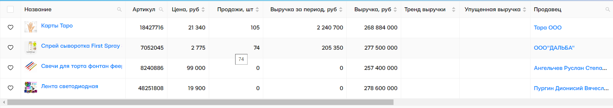

# Проект: Сортировка столбцов перетаскиванием.

### [ Ссылка на проект ](https://rassellek.github.io/test_quest/)

### Цель и задачи проекта:

Реализовано веб-приложение (сайт) с возможностью перемещать столбцы между собой.

### Дополнительные возможности реализованные в проекте:

<ul>
<li>Использован шаблон проектирования Ant Design для продуктов корпоративного уровня.</li>
<li>Использование Next.js, - платформы для создания визуализируемых сервером приложений JavaScript на основе React.js, Node.js, Webpack и Babel.js.</li>
</ul>

 

### Данный проект создавался на стеке:

 

### Используемые программы:

